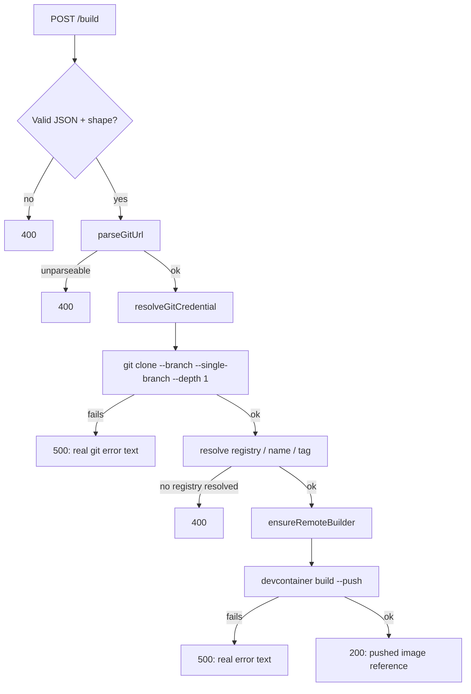

<title>Architecture</title>

# Architecture

devcontainer-builder is a single Node.js HTTP service
(`service/src/`) with three routes and no database — every real
decision it makes is derived fresh from the incoming request plus its
own startup configuration (see [Configuration](../reference/CONFIGURATION.md)).

## Request lifecycle: `POST /build`

1. **Shape validation** (`server.ts`'s `isValidBuildRequest`) — a
   request missing `repository`, or with a wrong-typed optional field,
   is rejected before anything real happens. See the
   [HTTP API reference](../reference/API.md) for the exact accepted
   shape and every status code.
2. **URL parsing** (`build.ts`'s `parseGitUrl`) — accepts
   `https://host/path`, `ssh://[user@]host[:port]/path`, and git's own
   SCP-style shorthand `[user@]host:path`. Anything else is a real
   parse failure, not a guess.
3. **Credential resolution** (`resolveGitCredential`) — request-level
   `gitCredentials` (always HTTPS) win; otherwise the server's own
   per-host configured entries apply, which may be HTTPS- *or*
   SSH-keyed. Whichever resolves determines the clone URL's protocol —
   a caller can pass an `https://` URL for a host the server only has
   an SSH credential for, and the actual clone still happens over SSH.
   Full rationale in
   [Credential handling](credential-handling.md).
4. **The clone itself** — always `--single-branch --depth 1`, on
   `branch` (default `main`) if given. A failure here (bad branch, no
   access, host unreachable) surfaces as a real 500 with the real `git`
   error text — devcontainer-builder never invents its own wording for
   an underlying tool's failure.
5. **Image resolution** (`resolveRegistry`, `deriveImageName`) —
   `image.registry`/`.name`/`.tag` from the request win field-by-field;
   anything omitted is derived: `name` from the repo path's last
   segment (`.git` stripped), `tag` from `sha-<short HEAD sha>`,
   `registry` from the server's configured mapping rules
   (`hostMatch`/`pathPrefix`, first match wins). No resolvable registry
   is a 400, not a 500 — see
   [0003: Registry resolution via mapping rules](../decisions/0003-registry-resolution-via-mapping-rules.md).
6. **The build** (`ensureRemoteBuilder` + `devcontainer build --push`) —
   `docker buildx create --driver remote <endpoint>` against the
   configured `BUILDKIT_ENDPOINT`, reused by name across requests
   (`docker buildx inspect` first, create only if missing); then the
   real `@devcontainers/cli` builds and pushes. There is **no local
   `dockerd`** anywhere in this path — see
   [0001: Remote BuildKit builder](../decisions/0001-remote-buildkit-builder.md)
   for why.
7. **Response** — `200 {"image": "<registry>/<name>:<tag>"}` on
   success. Any thrown `BuildRequestError` (a user-fixable problem
   discovered mid-build, e.g. no registry resolved) maps to 400;
   everything else — a real clone failure, a real build failure — maps
   to 500 with `err.message` as the real underlying text.

## Health endpoints

- **`GET /health/startup`** — always `200 {"status":"started"}` once the
  process is up. Kubernetes `startupProbe`; identical check to `/health/live`
  today (no separate async startup phase exists to distinguish them yet),
  kept as its own route so the two probes can be tuned independently — see
  [API reference](../reference/API.md#get-healthstartup).
- **`GET /health/live`** — always `200 {"status":"ok"}` once the
  process is up. Used as the liveness probe; it deliberately checks
  nothing beyond "the HTTP server is answering."
- **`GET /health/ready`** — `200 {"status":"ready"}` if
  `BUILDKIT_ENDPOINT` is configured, `503 {"status":"not
  ready","reason":"BUILDKIT_ENDPOINT not configured"}` otherwise. This
  is a **presence** check, not a live connectivity probe against
  BuildKit itself — a configured-but-unreachable endpoint still reports
  ready (and fails at build time instead, with a real error).

## Observability

- **Structured logs** — every log line is one JSON object
  ([pino](https://getpino.io/), Fastify's default logger), with a real
  string `level` (`"info"`, `"error"`, ...) rather than pino's own default
  numeric level — a small `formatters.level` override in `server.ts`, so
  the lines are directly filterable in whatever log sink scrapes container
  stdout (e.g. Grafana Loki) without a level-number lookup table.
- **`GET /metrics`** — Prometheus text-format metrics
  ([`prom-client`](https://github.com/siimon/prom-client)), Node.js
  process/runtime defaults plus real build/image-check/image-delete
  counters and a build-duration histogram — see
  [API reference](../reference/API.md#get-metrics).
- **Error tracking** — optional
  [Sentry](https://docs.sentry.io/platforms/javascript/guides/fastify/)
  SDK integration (`@sentry/node`'s `fastifyIntegration` +
  `setupFastifyErrorHandler`), entirely off unless `SENTRY_DSN` (or the
  settings file's `sentry.dsn`) is set. [GlitchTip](https://glitchtip.com/)
  works too, being Sentry-protocol-compatible — point `SENTRY_DSN` at it
  the same way. Real unexpected failures (500s, uncaught errors) get
  captured; documented 400s don't.
- **Distributed tracing** — optional
  [OpenTelemetry](https://opentelemetry.io/) auto-instrumentation
  (`@opentelemetry/auto-instrumentations-node`, covering the underlying
  `node:http` server every request goes through), entirely off unless
  `OTEL_EXPORTER_OTLP_ENDPOINT` (or the traces-specific
  `OTEL_EXPORTER_OTLP_TRACES_ENDPOINT`) is set — the same standard env
  vars any OTel SDK reads, so this composes with a Tempo/OTel Collector
  endpoint already configured elsewhere in the cluster, not an
  app-specific flag. Bootstrapped from `tracing.ts`, imported as the very
  first thing `index.ts` does — auto-instrumentation works by
  monkey-patching modules (`node:http`, etc.) at import time, so it has to
  run before anything else (including Fastify itself) ever imports them.
- **`GET /config`** — read-only, non-sensitive view of the service's own
  loaded configuration, credential material always redacted — see
  [API reference](../reference/API.md#get-config).

## Startup and shutdown

`index.ts` is the real entrypoint (see the
[Dockerfile](https://github.com/DeepSpaceCartel/devcontainer-builder/blob/main/service/Dockerfile)'s
`ENTRYPOINT`). It registers `uncaughtException`/`unhandledRejection`
handlers *before* dynamically importing `server.ts` — startup
misconfiguration (a bad settings file, an unrecognized CLI flag, an
invalid `SSH_HOST_KEY_POLICY`) throws synchronously during that import,
and only handlers registered ahead of it get a chance to format the
crash as one structured JSON line
(`{"level":"fatal","message":...,"stack":...}`) to stderr, instead of
Node's own default raw stack trace. A static `import "./server.js"`
at the top of `index.ts` would throw at the same uncatchable point — the
dynamic `await import(...)` at the bottom is what makes the handlers
already-registered by the time it runs.

The container runs as PID 1 with no init process, so the kernel's
default signal disposition doesn't apply — an unhandled `SIGTERM` would
be silently ignored rather than terminating the process, leaving a pod
to sit through its full `terminationGracePeriodSeconds` (30s default) on
every rollout or scale-down before kubelet resorts to `SIGKILL`.
`server.ts` installs an explicit `process.on("SIGTERM", () =>
process.exit(0))` for exactly this reason.

## Per-request isolation

Nothing about handling one `/build` request is shared with another
beyond the process's own startup configuration:

- Each request gets its own scratch clone directory
  (`mkdtemp(devcontainer-build-*)`), removed in a `finally` block
  whether the build succeeds or fails.
- Git and registry credentials get their own scratch files per request
  (a `.netrc`, an SSH key + `known_hosts`, a `DOCKER_CONFIG` overlay) —
  see [Credential handling](credential-handling.md) for why, and why
  none of it ever touches argv, an env var, or the clone URL itself.
- The remote buildx builder (`ensureRemoteBuilder`) is the one thing
  genuinely shared and reused across requests, by design — recreating
  it per request would mean re-registering the same named builder with
  the same remote endpoint on every single call, for no benefit.
