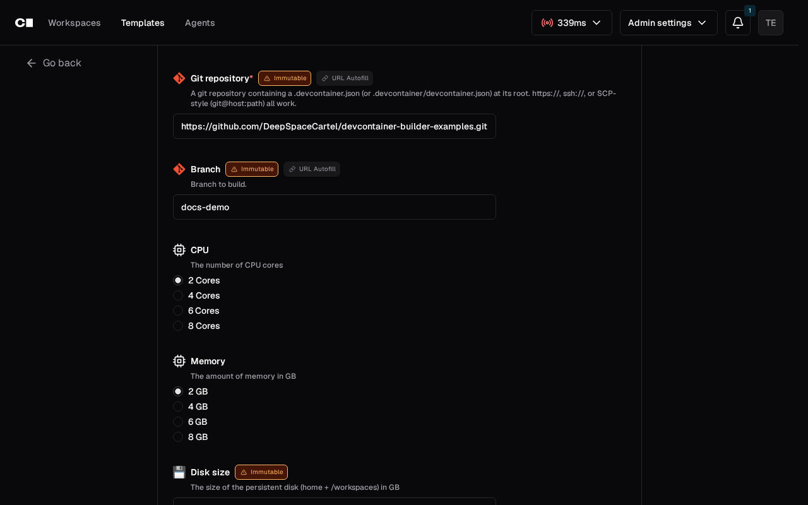
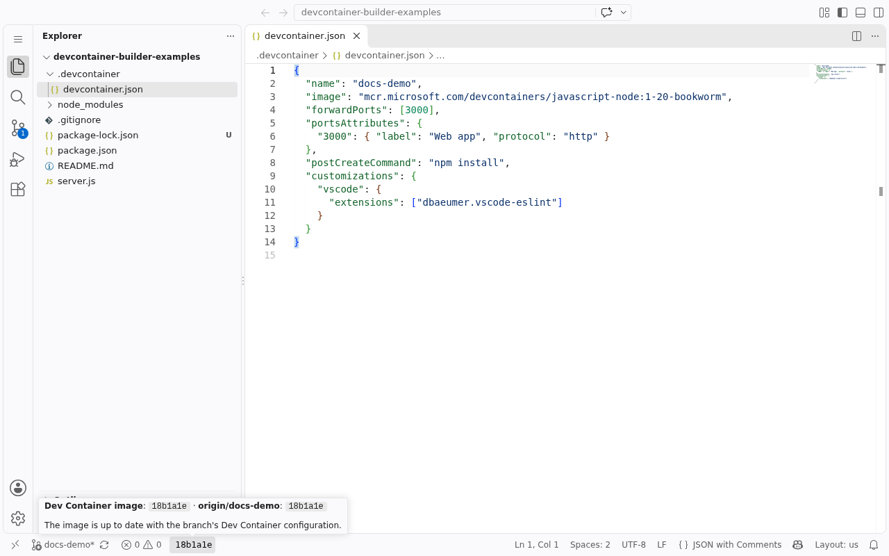
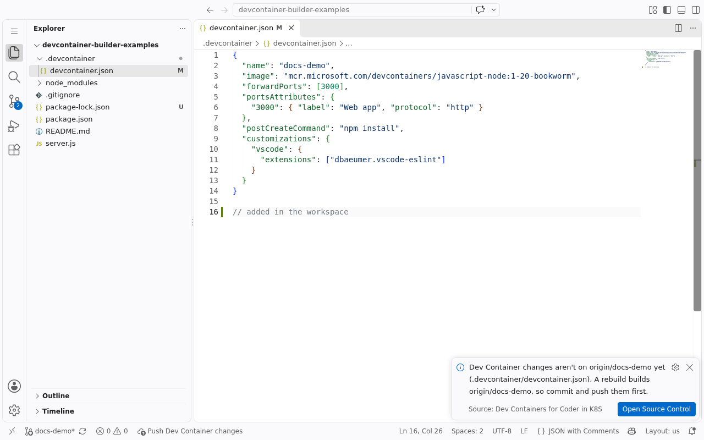
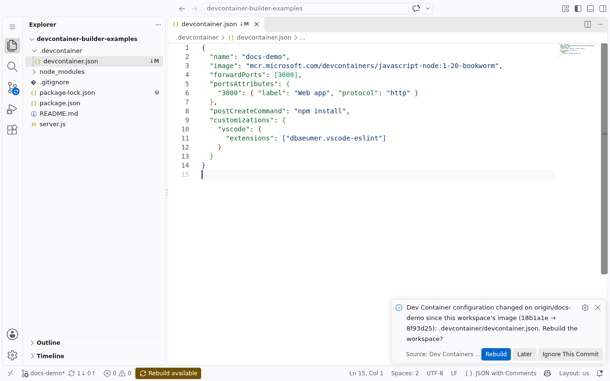
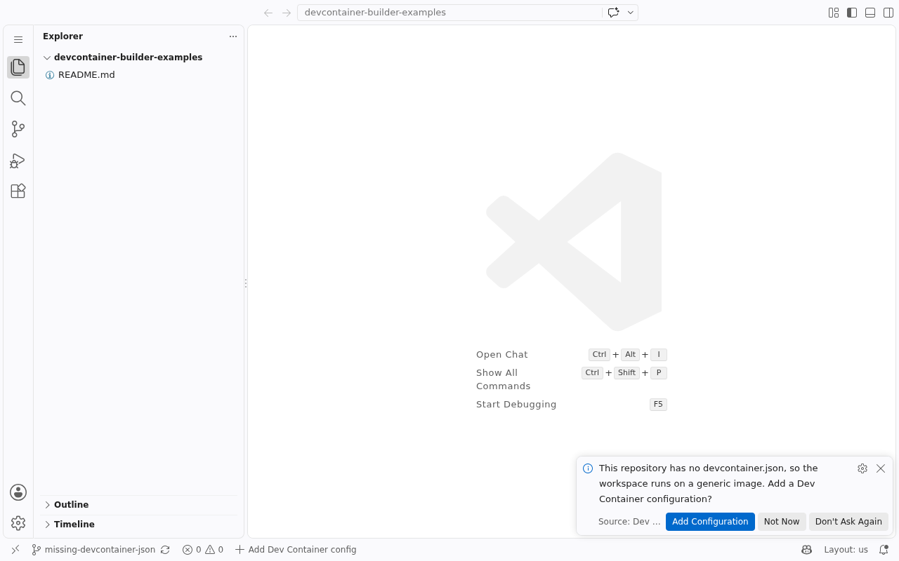

<title>Your first workspace</title>

# Your first workspace

Open a repository in a Coder workspace built from its `devcontainer.json`,
change its configuration, and rebuild. This takes about ten minutes. You
need VS Code and an account on your team's Coder deployment, which your
platform admin [set up](platform.md).

## 1. Install the extension

In VS Code, search the Extensions view for **Dev Containers for Coder in
K8S** (`deepspacecartel.devcontainer-builder`). It's on the VS Code
Marketplace, and on Open VSX for VSCodium, Cursor and others.

It works together with the **Coder** extension (`coder.coder-remote`),
which connects VS Code to workspaces. You'll be offered it the first time
it's needed.

## 2. Clone a repository into a workspace

Run **Coder: Clone Repository in Workspace…** from the Command Palette.

1. **Log in to Coder** if asked. If you've used the `coder` CLI on this
   machine, its login is reused. Otherwise, enter your Coder URL and paste the
   token from the page it opens.
2. **Pick the repository** in the same picker **Git: Clone** uses. Signed in
   to GitHub in VS Code, choose **GitHub** to browse and filter your
   repositories. Or paste any git URL.
3. **Pick the branch.** The default branch comes first.
4. **Link your GitHub account** if your team's template asks for it (for
   private repositories). A browser page opens; approve it once.
5. **Wait for the build.** A progress notification follows it through building
   the image, starting the workspace, cloning and running the repository's
   setup hooks. The first build of a repository takes a minute or two.
6. **VS Code opens in the workspace,** on the cloned repository, in a new
   window.

Already have a workspace on that repository and branch? The command offers
to open it instead, starting it if it's stopped.

!!! tip "Without VS Code"
    The Coder dashboard's **Create workspace** asks for the same **Git
    repository** and **Branch**, and its workspace page has **VS Code
    Desktop** and **VS Code Web** buttons.

    

## 3. Look around

When VS Code asks whether you trust the authors of the folder, **trust it**:
it's your repository, and VS Code doesn't run the extension in Restricted
Mode.

- The **status bar** shows the commit the workspace's image was built from,
  e.g. `a1b2c3d`.
- **Terminals** run as the repository's `remoteUser`, with its
  `containerEnv`/`remoteEnv` set.
- The repository's **VS Code extensions and settings** (its
  `customizations.vscode`) are installed.
- **Forwarded ports** are listed as apps on the workspace page in the dashboard.
- **Your home and the repository persist** across restarts. Everything else
  comes fresh from the image on every start.

## 4. Change the Dev Container configuration

Edit `.devcontainer/devcontainer.json`, for example by adding a Feature.

1. The status bar shows **Push Dev Container changes**: a rebuild always
   builds what's on the branch's remote, so local edits don't count yet.

    

2. Commit and push.
3. The status bar shows **Rebuild available**, with a notification:
   **Rebuild**, **Later** or **Ignore This Commit**.

    

4. **Rebuild.** The workspace restarts on an image built from the pushed
   configuration. Your home and the repository folder are kept, including
   uncommitted work.

One-click Rebuild needs a Coder session inside the workspace. Run
`coder login <your Coder URL>` once in its terminal. Without it, Rebuild
opens the workspace's settings page, where you increase **Rebuild** by hand.

## 5. A repository without a configuration

Clone a repository that has no `devcontainer.json`. It still gets a
workspace, on a generic Ubuntu image. The status bar shows **Add Dev
Container config**, which opens the Dev Containers extension's own **Add Dev
Container Configuration Files…**: pick a template and Features, then commit,
push and rebuild as above.

## Next

- [Working in a workspace](../guides/working-in-a-workspace.md) covers
  Dev Container variables, ports, what persists, and the rebuild prompt in
  detail.
- [devcontainer.json support](../reference/devcontainer-json.md) lists every
  property and what it becomes in a workspace.
