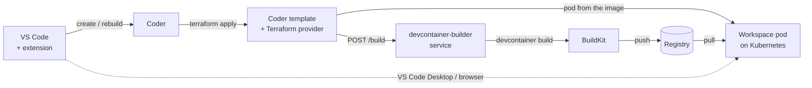

<title>devcontainer-builder</title>

# Dev Containers for Coder on Kubernetes

**Self-hosted Codespaces.** Pick a git repository, and get a
[Coder](https://coder.com) workspace built from that repository's own
`devcontainer.json`, running on your own Kubernetes cluster. You get its
image, Features, Dockerfile, lifecycle commands, environment, ports and VS Code
extensions. There's no local Docker and no per-core-hour bill, and the code
never leaves your network.

## How it works for a developer

1. **Pick a repository.** In VS Code, **Coder: Clone Repository in
   Workspace…** lists your GitHub repositories like *Git: Clone* does. You can
   also use the Coder dashboard, or an **Open in Coder** badge in a README.
2. **The image is built from its Dev Container configuration**, on BuildKit
   inside your cluster, and pushed to your registry tagged with the commit
   (`sha-<commit>`). The workspace starts on it.
3. **Code** in VS Code Desktop or VS Code in the browser, opened on the
   cloned repository. Home and repository persist across restarts.
4. **Push a change to `.devcontainer/`** and the workspace offers **Rebuild
   available**. One click moves it onto the new image. A repository without
   a configuration gets a generic image and a prompt to add one.

## What's in the box

| Piece | What it does |
|---|---|
| **devcontainer-builder** (service + [Helm chart](../reference/HELM.md)) | Clones the repository and builds its Dev Container image with the official Dev Containers CLI on a remote BuildKit, then pushes it. It also reads a built image's merged configuration back for the template. Runs once per cluster. |
| **The Coder template** ([reference](../reference/template.md)) | Turns a repository and branch into a workspace pod: the build, the user, the clone, the hooks, env, mounts, ports, resources, VS Code. |
| **The Terraform provider** ([reference](../reference/TERRAFORM-PROVIDER.md)) | `deepspacecartel/devcontainer-builder`, which the template uses to call the service. |
| **The VS Code extension** ([reference](../reference/vscode-extension.md)) | *Dev Containers for Coder in K8S*: clone a repository into a workspace, rebuild when the configuration changes, add one where there's none. |

-   :material-server-network:{ .lg .middle } **Platform admins**

    ---

    Install devcontainer-builder and BuildKit, push the template, and
    optionally enable private repositories. About 15 minutes.

    [:octicons-arrow-right-24: Set up the platform](../getting-started/platform.md)

-   :material-laptop:{ .lg .middle } **Developers**

    ---

    Install the extension, open a repository in a workspace, and rebuild
    when its configuration changes.

    [:octicons-arrow-right-24: Your first workspace](../getting-started/first-workspace.md)

-   :material-file-table:{ .lg .middle } **devcontainer.json support**

    ---

    Every property and what it becomes in a Kubernetes workspace, including
    what can't work there and why.

    [:octicons-arrow-right-24: Support matrix](../reference/devcontainer-json.md)

-   :material-tag-check:{ .lg .middle } **Versioning and upgrades**

    ---

    What 1.x promises to keep stable, and how to upgrade from 0.x.

    [:octicons-arrow-right-24: Versioning](../project/versioning.md)

## Why a build service

A Coder template on Kubernetes needs a container image when the pod is
scheduled. Templates are applied by coderd's own isolated Terraform
provisioner, which can't build images itself. So building the Dev Container
image happens in a separate, long-running service in the cluster. The
template calls it the same way it calls Kubernetes to provision a volume
before the pod. How that service works is in [Architecture](../concepts/architecture.md);
calling it directly, without Coder, is in the
[build service quickstart](quickstart.md).
